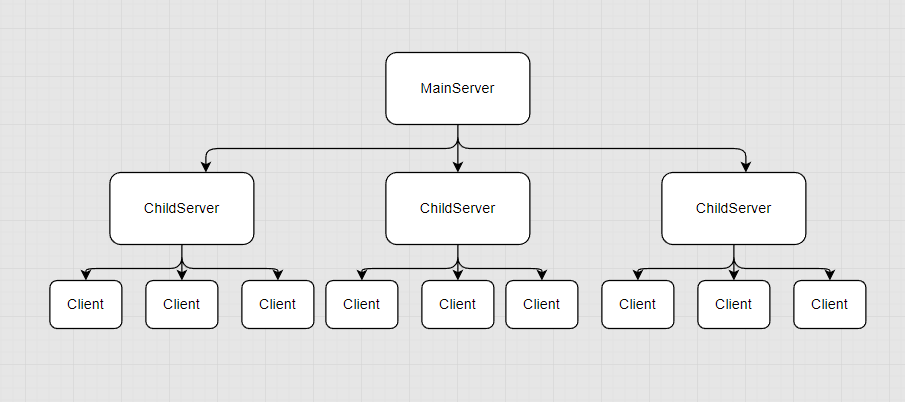
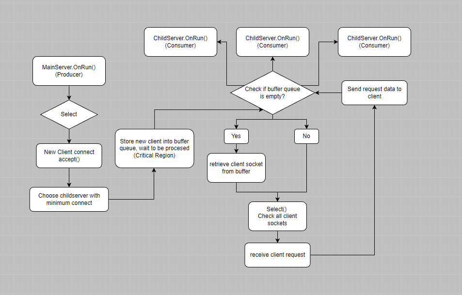

# Introduction

This project is a cross-platform (Linux, Windows) high-concurrency network Reactor model developed with modern C++.

It is implemented by rewriting the select system call. This framework is capable of handling data concurrency at the magnitude of millions of bytes.

# Environment

Windows 10 Pro

Visual Studio 2022

g++ 11.2.0

# Technical points

- Asynchronously process data via **buffer queues**, decouple modules and achieving separation of data transmission and reception.

- Construct A **thread pool** with a **buffer queue** to avoid the overhead associated with frequent thread creation and destruction.

- Implement load balancing via **minimum connection** method, which enhance the overall performance of the server.

- Implemented mechanisms such as **memory pool** and **object pool** for efficient memory management

- Utilized **smart pointers** for RAII to ensure safe memory management.

# Model

